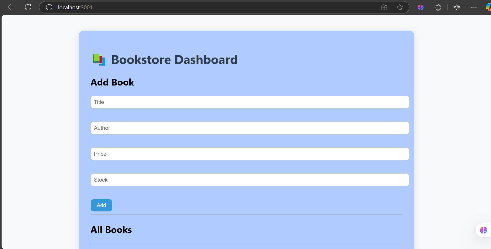

# MERN Bookstore Dashboard


This project is a MERN (MongoDB, Express, React, Node.js) stack-based dashboard for managing a bookstore. It allows users to perform CRUD operations on books and provides a user-friendly interface for managing the bookstore's inventory.  

## Table of Contents
- [Features](#features)
- [Prerequisites](#prerequisites)
- [Installation](#installation)
- [Running the Application](#running-the-application)
- [Project Structure](#project-structure)
- [How to Contribute](#how-to-contribute)
- [License](#license)

---

## Features
- Add, update, delete, and view books.
- Responsive and user-friendly interface.
- Backend API built with Node.js and Express.
- MongoDB for database management.
- React for the frontend, minimal user interface.

---

## Prerequisites
Before you begin, ensure you have the following installed:
- [Node.js](https://nodejs.org/) (v14 or higher)
- [MongoDB](https://www.mongodb.com/) (local or cloud instance)
- [Git](https://git-scm.com/)

---

## Installation

### 1. Clone the Repository
```bash
git clone https://github.com/IbrahimBagwan1/MERN-bookstore-dashboard.git
cd MERN-bookstore-dashboard
```

### 2. Install Dependencies
#### Backend
Navigate to the `backend` folder and install dependencies:
```bash
cd backend
node install
node init -y
```

#### Frontend
Navigate to the `frontend` folder and install dependencies:
```bash
cd ../frontend
npm install
```

---

## Running the Application

### 1. Start MongoDB
Ensure MongoDB is running locally or provide a connection string for a cloud instance (e.g., MongoDB Atlas).

### 2. Download dependencies
Open Frontend in terminal and run:  npm install
Open BackEnd in termianl and run: 
node install
node init -y

### 3. Start the Backend Server
Navigate to the `backend` folder and run:
```bash
node index.js
```
The backend server will start on `http://localhost:3000`.

### 4. Start the Frontend Server
Navigate to the `frontend` folder and run:
```bash
npm start
```
The frontend will start on `http://localhost:3001`.

---

## Project Structure
```
MERN-bookstore-dashboard/
├── BackEnd/        # Node.js and Express backend
│   ├── models/     # Mongoose models
│   ├── routes/     # API routes
│   ├── controllers/ # Request handlers
│   ├── server.js   # Entry point for the backend
│   └── .env        # Environment variables
├── FrontEnd/       # React frontend
│   ├── src/
│   │   ├── components/ # Reusable components
│   │   ├── pages/      # Application pages
│   │   ├── App.js      # Main React component
│   │   └── index.js    # Entry point for the frontend
└── README.md       # Project documentation
```

---

## How to Contribute
1. Fork the repository.
2. Create a new branch:
  ```bash
  git checkout -b feature-name
  ```
3. Make your changes and commit them:
  ```bash
  git commit -m "Description of changes"
  ```
4. Push to your branch:
  ```bash
  git push origin feature-name
  ```
5. Open a pull request.

---

## License
This project is licensed under the MIT License. See the [LICENSE](LICENSE) file for details.

---

For more details, visit the [GitHub Repository](https://github.com/IbrahimBagwan1/MERN-bookstore-dashboard.git).
